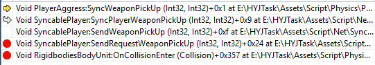
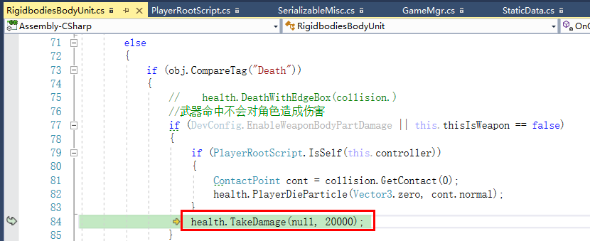

#todo

UI

3V3
积分同步

## 拾枪


## 掉下去死亡

## 超出屏幕范围死亡
```CSharp
        if (GameSelector.map_game_mode == MapGameMode.Normal && BattleServer.IsHost && this.player != null && player.info != null && hasControllerScript && this.player.flyAble == false && BattleServer.IsNetwork)
        {
            var position = this.player.info.playerTransformForTheTop.position;

            if (System.Math.Abs(position.y) > 40f)
            {
                //Debug.Log("距离太远， 超出屏幕范围");
                this.TakeDamage(null, 2000);
            }
```

## 复活

# 走着进入匹配

# 参考跑酷爬楼梯定住

# 一个固定地图

 occupy
# 游戏中加载下一个地图

旗子1：5047  30/15


旗子2：5048  30/16


梯子： 8070   ** 30/2**


# 向上爬
                    cmp.enableForce = false;
                }

                if ((cmp.misc.info.areOnTheTerrained || false) || (false || cmp.controller.flyAble))
                {
                    cmp.forceForGravitationalEnergy = 0f;
# 操作

## 玩家控制的操作
PlayerOptUpdateSystem

能不能飞行就看这个：(平衡重力？)
**MovetivationSystem**


 用飞行方案：
 .flyAble = true;

*****
## 靶场
整个地图嵌在gamelogin中的

进入靶场：
**SceneGameLogin.lua:**
```CSharp
function t:EnterToTrain()

		SceneMgr:Trigger_HasPlayerInLoginScene();

		self:StartSpawnWeapons();
		
		self:CreateLoginSceneLocalPlayer();

		Events.fire("ui","AddAsyncTask", function()
			if CS.LuaCodeBridge then
				self:CreateLoginSceneAIPlayer();

				self:ShowPanelTalkBubble(false);
				
				local skinTable = uitlsskin:GetSkinCompomentWithID(defaultSkinId);
				if skinTable and #(skinTable) > 0 then
					for partId, skinId in pairs(skinTable) do
						CS.LuaCodeBridge.GameLoginLoadTargetPlayerSkinPart(partId, skinId); --稻草人换肤
					end
					CS.LuaCodeBridge.GameLoginTrySetTargetPlayerJointRendererVisible();
				else
					CS.LuaCodeBridge.GameLoginSetTargetPlayerJointRendererVisible(Enum.JointRendererVue.FULL);
				end
				CS.LuaCodeBridge.GameLoginRemoveTargetSkinComponent();
			end
		end)	
end
```
离开靶场:
```CSharp
function t:LeaveFromTrain()
	UI.Close("UIPanelGameLoginTalkBubble");

	self:RemoveLoginSceneAIPlayer();
	self:RemoveLoginSceneLocalPlayer();

	self:RemoveSpawnWeapons();

	SceneMgr:Trigger_NoPlayerInLoginScene();
end
```


--隐藏主界面 除了 遥感
```CSharp
function t:HideForSkinPreviewShow()
    if self.btn_train then
        self.isShow = false;
        self:SetVisible(false);
        self.panel_head_name:SetVisible(false);
        if self.panel_airanim then
            self.panel_airanim:SetVisible(false);
        end
        if self.panel_dailytask then
            self.panel_dailytask:SetVisible(false);
        end
        -- CS.LuaCodeBridge.GameLoginHideNotify();
        CS.LuaCodeBridge.SetMainCityCameraDepth(0);
    end
end
--显示主界面
function t:ShowForSkinPreviewHide()
    if self.btn_train then
        self:SetVisible(true);
        self.isShow = true;
        self.panel_head_name:SetVisible(true);
        if self.panel_airanim then
            self.panel_airanim:SetVisible(true);
        end
        self:_WhenPulledDailyTaskRefresh();
        if self.panel_dailytask then
            self.panel_dailytask:SetVisible(true);
        end
        -- CS.LuaCodeBridge.GameLoginResumeNotify();
        CS.LuaCodeBridge.SetMainCityCameraDepth(19);
    end
end

```

## 引导地图下载：
CS.HttpTaskMgr.ins:DownLoadMap （这个函数优先读本地）

## 跳转引导地图
CS.LuaCodeBridge.GoMapPreviewWithGuide(self.guideSceneMapId);

```CSharp
        public static void GoMapPreviewWithGuide(string uuid)
        {
            if (string.IsNullOrEmpty(uuid))
            {
                return;
            }
            GameMgr.mode = BattleMode.Guide;
            MapEditor.MapPreviewRunner.map_preview_uuid = uuid;
            //跳转场景
            SceneMgr.LoadLevel("MapPreview");
        }
```