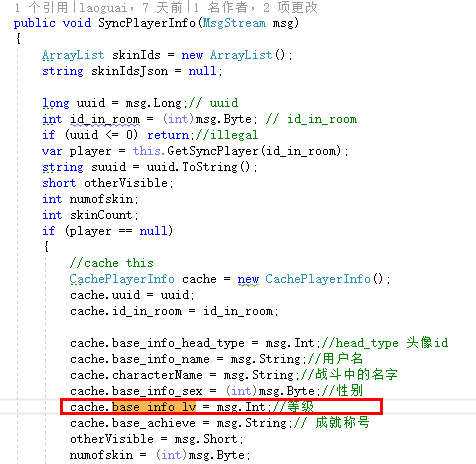
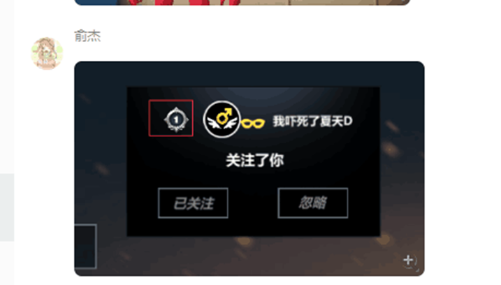
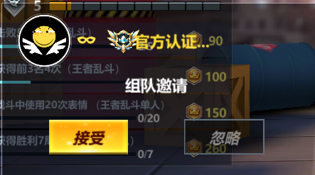

消息：
关注提醒列表：
SEND_RPC_JSON_JSON_NIL("friend", "remind_list"

粉丝？：
SEND_RPC_JSON_JSON_NIL("friend","base_info_list"

SEND_RPC_JSON_JSON_NIL("friend","fans_list","uuid:"

SEND_RPC_JSON_JSON_NIL("friend","follow_list","uuid:".. self.uuid 

相互关注：
SEND_RPC_JSON_JSON_NIL("friend","both_list"

SEND_RPC_JSON_JSON_NIL("friend","base_info"

SEND_RPC_JSON_JSON_NIL("friend","find_by_name"

SEND_RPC_JSON_JSON_NIL("friend","base_info_fans_focus"

SEND_RPC_JSON_JSON_NIL("friend", "recommend_list"

SEND_RPC_JSON_JSON_NIL("friend", "follow_ok"

SEND_RPC_JSON_JSON_NIL("friend","state_list"

SEND_RPC_JSON_JSON_NIL("friend", "invite_recommend_list"

--RPC?
T2V2_BeInvite

MsgType.GAME_PLAYER_INFO (39)

## 好友互粉 UIPanelInvite-->InviteItem

好友：
DataMgr.DataSocialInfo:GetDetailOfUser

SEND_RPC_JSON_JSON_NIL("friend", "follow_ok"

互粉：
DataMgr.DataSocialInfo:GetInviteRecommendList

SEND_RPC_JSON_JSON_NIL("friend", "invite_recommend_list",

## 别人关注了你 UIPanelCareBox

SEND_RPC_JSON_JSON_NIL("friend", "remind_list"

## 他人的个人主页 UIPanelOtherInfo 

SEND_RPC_JSON_JSON_NIL("friend","base_info

## 组队邀请 UIPanelTeam2v2BeInvite

设置积分
hset player-109572 bs_t1_score 20000

bs_t1_score

T2V2_BeInvite

## 跑酷loading UIPanelParkourPreLoading-->UIComponentPlayerHeadInfo

## 房间邀请 UIPanelRoomBeInvite

## 关注 UIPanelCareInfo-->CareItem

## 粉丝 同上

## 好友推荐 UIPanelStranger-->StrangerItem

## 查找玩家

UIPanelInvite

img_duanwei1

InviteItem

UIPanelCareBox

跑酷
===============================

UIPanelParkourPreLoading

UIComponentPlayerHeadInfo

组队邀请
===============================
UIPanelTeam2v2BeInvite
