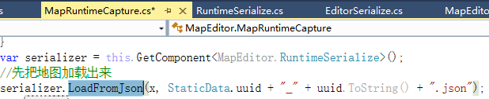

110482_
## 优化前后文件大小比较

由上图可以看出159个文件总大小降为2.14/4.1=52.2% 也就是降了47.8%

## 优化前后加载(反序列化)效率对比

159张地图
优化前：9.967215s
优化后：9.164137s

加载时间因地图变小带来一点点提升


## 优化前后保存(序列化)效率对比
159张地图
优化前：0.9330788 s
优化后：0.9818764 s

保存时间因后处理带来 5%的消耗, 这个在保存地图时带来的一点消耗，不影响战斗

MapEditorUtils.RequestEditorLocalMap("1")
MapEditorUtils.SettingQuitAndSave()

## 加载测试代码
[MapRuntimeCapture.cs](_v_attachments/20190918152539391_22808/MapRuntimeCapture.cs)
MapRuntimeCapture.cs
```CSharp
                var beginTime = Time.realtimeSinceStartup;
;
                string x = LocalStorageMapTmp.ins.LoadTextFromDisk(StaticData.uuid + "_" + uuid.ToString() + ".json");
                if (string.IsNullOrEmpty(x) || !Serializable.Map.IsMapJson(x))
                {
                    download_ok = false;
                }
                //普通地图没读取成功，尝试UGC地图, UGC地图名是普通地图+"_1"
                if (download_ok == false)
                {
                    x = LocalStorageMapTmp.ins.LoadTextFromDisk(StaticData.uuid + "_" + uuid.ToString() + "_1" + ".json");
                    if (string.IsNullOrEmpty(x) || !Serializable.Map.IsMapJson(x))
                    {
                        download_ok = false;
                    }
                    else
                    {
                        download_ok = true;
                    }
                }

                if (download_ok)
                {
                    if (showWeapon)
                    {
                        ShowWeaponSpawnPoints();
                    }
                    var serializer = this.GetComponent<MapEditor.RuntimeSerialize>();
                    //先把地图加载出来
                    serializer.LoadFromJson(x);
                    var endTime = Time.realtimeSinceStartup;

                    var offsetTime = endTime - beginTime;
                    MapEditorMgr.ins.totalReadTime += offsetTime;
                    Debug.LogError("OffsetTime: " + offsetTime);
```
## 批量转换地图代码(在生成地图投影的时候调用)


RuntimeSerialize.cs-->LoadFromJson(string json)

```CSharp
            var outputjson = map.ToJson();
            outputjson = outputjson.Replace(",\"scale\":{\"x\":1,\"y\":1,\"z\":1}", "");
            outputjson = outputjson.Replace(",\"rotation\":{\"x\":0,\"y\":0,\"z\":0}", "");
            Debug.LogError("outputjson: " + outputjson);
            Debug.LogError("file: " + file);

            var fileName = LocalStorageMapTmp.ins.GetRootDirectory() + "/" + file + "output";

            try
            {
                using (FileStream f = new FileStream(fileName, FileMode.Create))
                {
                    var ss = new StreamWriter(f);
                    ss.Write(outputjson);
                    ss.Flush();
                    f.Flush();
                    ss.Close();
                    f.Close();
                }
            }
            catch (Exception e)
            {
                return;
            }
```


## 优化后
double-->float

压缩scale rotate:


## 查找替换
,"scale":{"x":1,"y":1,"z":1}
空
,"rotation":{"x":0,"y":0,"z":0}

### 批量重命名地图文件

```CSharp
@echo off

set a=00

setlocal EnableDelayedExpansion

for %%n in (*.json) do (

set /A a+=1

ren "%%n" "110482_!a!.json"

)
```