# 解锁地图
*****跨赛季
*****连续解锁
*****定时器

```lua
--赛季地图 最大解锁区域号
function t:GetUnlockMapIndex(  )
end

--赛季地图 设置最大解锁区域号
function t:__Inner_SetUnlockMapIndex( value )
end

--赛季地图 当前任务游戏场数
function t:GetUnlockMapPlayNum(  )
end

-- 赛季地图设置当前任务游戏场数
function t:__Inner_SetUnlockMapPlayNum( value )
end

--赛季地图 当前任务结束时间
function t:GetUnlockMapEndTime(  )
end

--赛季地图 设置当前任务结束时间
function t:__Inner_SetUnlockMapEndTime( value )
end
```

主界面
UIPanelBattleSeasonMain2
   奖励组件
   SeasonMissionRewardSmallItem
   地图组件
    SeasonMissionMapItem
奖励
UIPanelSeasonMissionReward
    奖励显示组件
    SeasonMissionRewardBigItem

解锁地图提示
UIPanelMapUnlockTip
解锁地图展示
UIPanelMapUnlockShow

表格：
赛季冲段奖励S2(battle_season_mission_s2).xlsx
赛季解锁地图S2(battle_season_unlock_map_s2).xlsx

battle_season_mission_s2
battle_season_unlock_map_s2

段位奖励：
self.txt_season_number:SetText(  (data.bs_t1_id+1));

bs_um_num 
__Inner_SetUnlockMapIndex

bs_um_play_num
__Inner_SetUnlockMapPlayNum

bs_um_end_time
__Inner_SetUnlockMapEndTime

### 结算3/3
GameLogin创建角色：
PlayerManager.CreateMainPlayer(self.img_touch_self.raw.gameObject);
CS.LuaCodeBridge.SetPlayerPos

背包界面创建角色
PlayerManager.CreatePlayerByScene(Enum.EnumShowScene.Bag,__skinColor or 1,Enum.EnumShowScene.Default,__temp,self.img_touch.raw.gameObject);

设置人物父节点:
PlayerManager.SetPlayerParent(self.player_id_1, self.node_player1.raw.gameObject);

### 组队观战
UIPanelBattleDieBroadcast

### 切换场景
SceneMgr-.LoadSceneName ==> CS.LuaCodeBridge.LoadLevel(scene_name);==>self.currentScene=_list_[scene_lua_name].new();


c# 
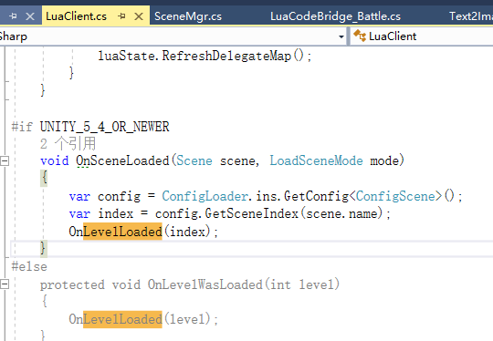
main.lua
OnLevelWasLoaded ==> ON_LEVEL_LOADED

# 1. 战斗2/3
ref:
UIPanelNewStar
ComponentNewStar

001 界面打开自动播
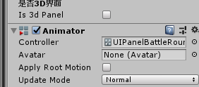

002 控制显示的时候自动播
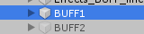

003 奖励轨迹动画：
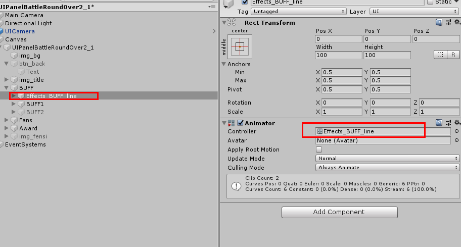
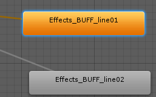

004 


005


006 

升级动画：
动态加载

# 1. 战前流程
## 1.1. 匹配成功延后2秒跳转


# 2. 动态加载场景物件
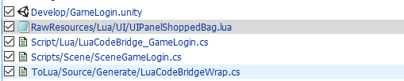
[LuaCodeBridge_GameLogin.cs](_v_attachments/20191009151614057_23843/LuaCodeBridge_GameLogin.cs)
[SceneGameLogin.cs](_v_attachments/20191009151614057_23843/SceneGameLogin.cs)
# 3. 正式版H5


# 4. 匹配前备份
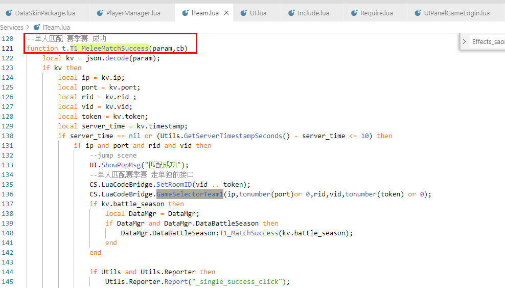
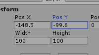

# 5. 结算3.1
  异步
  断网
 分桢 

1 入口函数可能是异步的
2 Continue分桢处理？


支持代码段串联入口写法：

一段代码执行完后要执行 回调函数DataMgr.DataBattleResultFlow.callback,触发下面一个代码段的执行
分两种情况
1, 关闭界面触发，要在界面初始化传入回调函数 e.g. 
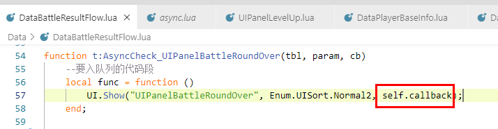
2, 纯代码片段，在代码片段的最后加上代码：
DataMgr.DataBattleResultFlow:Continue()

Events.add("global","ON_LEVEL_LOADED",self);

Note:
--队列中的界面独立触发的界面时不要关闭原界面, 以防原界面是队列中最后一个界面时触发返回大厅，返回大厅会自动关闭所有界面
## 5.1. todo 
中途断网

通行证领取奖励

## 5.2. *****两个相同的界面不能连着关闭 打开
加上这行有用：_acvtive_panels.Remove(name);
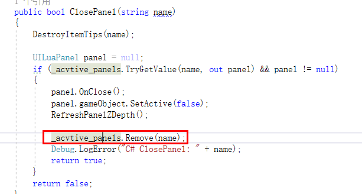
但连着的UIShowMulti有问题

UIShowMulti--改成UIShow就好了

*****测试的时候发现不管该改没改，联系UI.ShowMulti都有问题

## 5.3. 断网
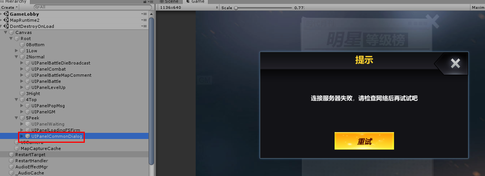

UIPanelCommonGotSomething：

```lua
        DataMgr.DataTeam:Team1_AsyncStartMatch(self.battleMode, function (ok)
            if self:_IsValid() then
                --cb param is int
                --1 enter match queue success
                --2 has exist in match queue
                --3 net error or server error
                if ok == 1 then
                    --enter queue success
                elseif ok == 2 then
                    --UI.ShowPopMsg("已经在队列里面了");
                else
                    UI.ShowPopMsg("请求失败,请稍后再试");
                    self:CancelMatch();
                end
            end
        end)
```

# 6. 换装

## 6.1. 背包界面穿戴列表来源：
GetSkinList
local skinIds = DataMgr.DataSkinPackage:GetSkinList();

C-->S:
同步穿戴列表：
DataMgr.DataSkinPackage:UpdataSkinList(tryWears, function(ret)

SEND_RPC_JSON_JSON_NIL("skin","update_skin_list",
## 6.2. 同步
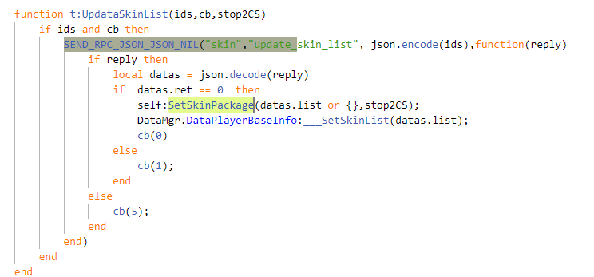

# 7. 恢复战前准备
#1001622 主界面修改——界面布局

# 8. 金币加成
UIPanelCommonDetail
UIPanelBagSeleItem

UIPanelMall
UIPanelTreasureBox

800

# 9. 像素版本
```lua
function t:_CheckLocalData()
	local Utils = Utils;
	if Utils then
		local name =  Utils.PlayerPrefs.GetString("PlayerName");
		if (not name  or name== "" )and ENUM_NAMES then
			local index = Utils.RandomTableIndex(#ENUM_NAMES);
			local name = ENUM_NAMES[index];
			if name then
				Utils.PlayerPrefs.SetString("PlayerName",name);
				CS.StaticData.battle_name=name;
			end
		end
	end
end
```
0
## 9.1. 设置游戏模式
DataMgr.DataTeam:Team1_SyncGameMode(self.currentGameMode);

胜者为王 Enum.EnumGameMode.WildMelee
巅峰对决 Enum.EnumGameMode.MeleePK

更新战斗中名字：

WildMelleMode_RefreshData
胜者为王
UIPanelBattleWildMelee
ComponentWildMelee

## 9.2. 屏蔽战斗中按钮

UIPanelHeadName


:
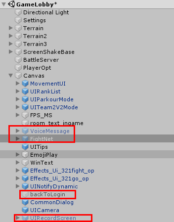

UIPanelCombat

## 9.3. 匹配成功加载界面名字
UIPanelTeam1PreLoading
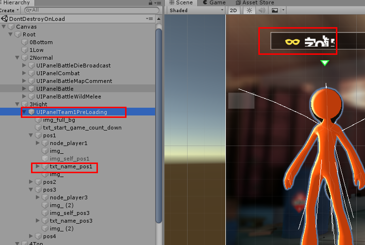


# 10. 赛季通行证
充值：

```
function t:_onSelectOnePay(index)
    if self.btn_return and index then
        self.last_click_index = index;
        local isAdOpen = self:__CheckAdEnable();
        if isAdOpen then
            if index == 0 then
                local cdTime = DataMgr.DataAD:GetRechargeAdLeftCdTime();
                if cdTime > 0 then
                    --ignore
                else
                    -- 播放广告 --
                    Utils.ADUtils.ShowVideoAdByPos(Enum.AdUnit.Recharge);
                end
                return;
            end
        end

        local tbx = TBX.pay;
        local payInfo = tbx[index];
        if payInfo then
            local device_type = CS.DevConfig._GamePlatformLua;
            if 0 == device_type then
                SDKPay:Pay(payInfo.id, payInfo.name, payInfo.price);
            else
                SDKPay:Pay("jdhcr_" .. payInfo.id, payInfo.name, payInfo.price);
            end
        else
            UI.ShowPopMsg("充值配置不存在");
     end
    end
end

```

    UIPanelSeasonPass
       Ref:UIPanelMallExcharge


                elseif task.type == TYPE_PassScore then
                    one:SetPassScore(task.amount);    
                elseif task.type == TYPE_ActiveBox then
                    one:SetActiveBox(task.amount);    
                elseif task.type == TYPE_BattleBox then
                    one:SetBattleBox(task.amount);      

###### 10.1.1.1.1.1. 单个和多个奖励
单个：
json.encode(data.general_reward): {"skin":"{\"id\":30131,\"expire\":1566974054}","skin_id":2091}
列表：
json.encode(data.general_reward): 
{"skins":[{"num":6,"expire":-1,"id":10070}],"skin_shops":[2920]}


## 10.2. todo
红点
时效
UI
预判

### 10.2.1. redis

--乱斗宝箱
hset player-109595 battle_box_coin_data 2279999
hset player-109595 battle_coin 100


hset player-109128 battle_box_coin_data 2191010
hset player-109128 battle_coin 100

hset player-109128 battle_box_coin_data 181181010
hget player-109128 battle_coin

hget player_welfare2-109128 bp_r_2_1

hget player_welfare2-109128 bp_r_1_1

hset player_welfare2-109128 bp_r_1_1 0
hset player_welfare2-109128 bp_r_1_2 0
hset player_welfare2-109128 bp_r_1_3 0
hset player_welfare2-109128 bp_r_1_4 0
hset player_welfare2-109128 bp_r_2_1 1
hset player_welfare2-109128 bp_r_2_2 0
hset player_welfare2-109128 bp_r_2_3 0
hset player_welfare2-109128 bp_r_2_4 0

hset player-109595 battle_box_coin_data 2341010


hmset player_welfare2-109128 bp_r_1_1 0 bp_r_1_2  0 bp_r_1_3  0 bp_r_1_4  0 bp_r_2_1 1  bp_r_2_2 0 bp_r_2_3 0 bp_r_2_4 0

hmset player_welfare2-109595 bp_r_1_1 0 bp_r_1_2  0 bp_r_1_3  0 bp_r_1_4  0 bp_r_2_1 0  bp_r_2_2 0 bp_r_2_3 0 bp_r_2_4 0

hmset player_welfare2-1095951 bp_r_1_1 0 bp_r_1_2  0 bp_r_1_3  0 bp_r_1_4  0 bp_r_2_1 0  bp_r_2_2 0 bp_r_2_3 0 bp_r_2_4 0

hmset player_welfare2-109129 bp_r_1_1 0 bp_r_1_2  0 bp_r_1_3  0 bp_r_1_4  0 bp_r_2_1 0  bp_r_2_2 0 bp_r_2_3 0 bp_r_2_4 0

hmset player_welfare2-109572 bp_r_1_1 0 bp_r_1_2  0 bp_r_1_3  0 bp_r_1_4  0 bp_r_2_1 0  bp_r_2_2 0 bp_r_2_3 0 bp_r_2_4 0

--手机
hmset player_welfare2-107347 bp_r_1_1 0 bp_r_1_2  0 bp_r_1_3  0 bp_r_1_4  0 bp_r_2_1 1  bp_r_2_2 0 bp_r_2_3 0 bp_r_2_4 0
--乱斗宝箱
hset player-107347 battle_box_coin_data 2260101

hget player_welfare2-109128 ad_buy_score
hset player_welfare2-109128 ad_buy_score 0

hset player_welfare2-109239 ad_buy_score 0

hset player_welfare2-109595 ad_buy_score 0

--调整积分
hset player-109128 pass_score 0

hset player-109595 pass_score 12801

hset player-109572 pass_score 12801

hset player-109595 battle_box_coin_data 2260101


hmset player_welfare2-109572 bp_r_1_1 0 bp_r_1_2  0 bp_r_1_3  0 bp_r_1_4  0 bp_r_2_1 0  bp_r_2_2 0 bp_r_2_3 0 bp_r_2_4 0
hset player-109572 pass_score 129628


hset player-109572 battle_coin_2 100

UIPanelBagSeleItem
## 10.3. 表格：

### 10.3.1. 道具表中道具详细信息：

通用奖励表： TBX.general_reward  （.type 3： 皮肤  1： 金币  2： 钻石 8： 服饰币 ）
道具表： TBX.goods_map
描述信息： TBX.goods_type-->goods_general
                 TBX.goods_type-->goods_lottery

--皮肤
```
TBX.general_reward
    TBX.skinshop
        TBX.skins

```
--道具


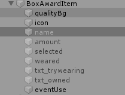

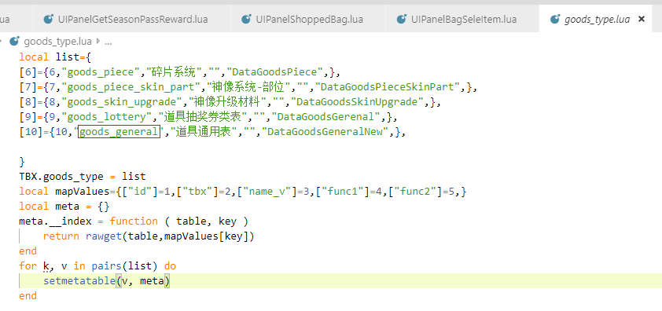

## 10.4. Ref

通用奖励：
UIPanelCommonGotSomething
ComponentCommonGotSomethingItem

背包:
UIPanelShoppedBag
ShoppedBagItem

设置回调：
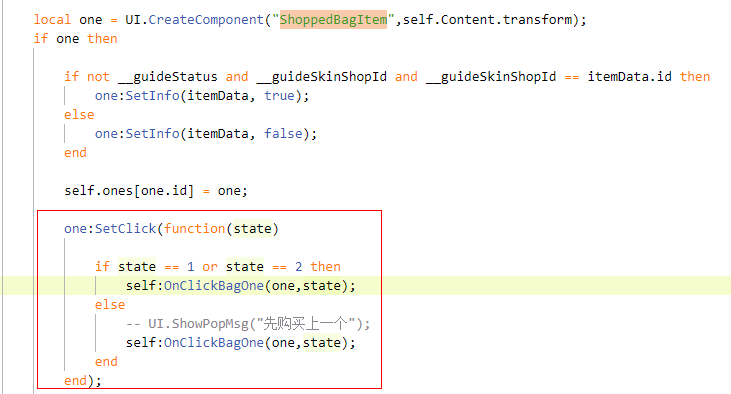
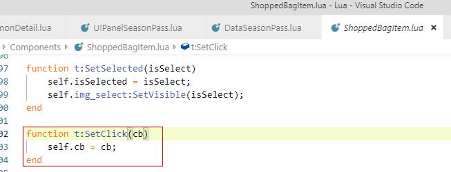
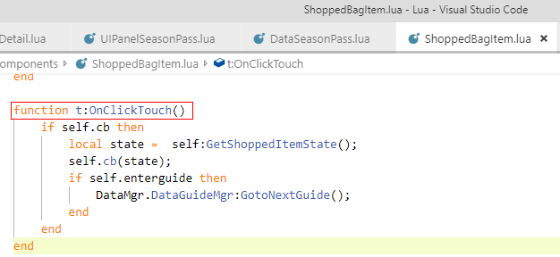
## 10.5. 进包裹&通用领取界面

```
DataMgr.DataGoodsMgr:__Inner_GotGeneralRewardBatch(json.encode(kv.general_reward));
DataMgr.DataActivityPush:ShowRewardDlg(kv.general_reward);
```

## 10.6. 滑动列表到指定位置

```	
//__value 0: 最左边 1: 最右边
self:Timeout(0.1, function ()
		if self.Content then
			local __value = DataMgr.DataNewStarMgr:GetSignSliderValue();
			local __sizeX = self.Content:GetSizeDeltaX();
			self.ScrollView:SetHorizontalNormalizedPosition(__value);
		end
	end);
end
```


# 11. general_reward对应关系

TBX.general_reward.skinshop_id-->TBX.skinshop

`TBX.skinshop.type_id`-->TBX.skins


# 12. Q&A
## 12.1. 新的组件UIComponentSeasonPass按钮点击不起作用
A，Component 没require..