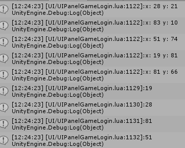

## 有bug？：


## 代码：
```lua
local table = require "table"
local insert = table.insert
local remove = table.remove

local priority_queue = {}

function priority_queue.new(cmp, initial)
    local cmp = cmp or function(a,b) return a < b end

    local pq = setmetatable({}, {
        __index = {
            size = 0,
            push = function(self, v)
                insert(self, v)
                local next = #self
                local prev = (next-next%2)/2
                while next > 1 and cmp(self[next], self[prev]) do
                    self[next], self[prev] = self[prev], self[next]
                    next = prev
                    prev = (next-next%2)/2
                end
            end,
            pop = function(self)
                if #self < 2 then
                    return remove(self)
                end
                local root = 1
                local r = self[root]
                self[root] = remove(self)
                local size = #self
                if size > 1 then
                    local child = 2*root
                    while child <= size do
                        if cmp(self[child], self[root]) then
                            self[root], self[child] = self[child], self[root]
                            root = child
                        elseif child+1 <= size and cmp(self[child+1], self[root]) then
                            self[root], self[child+1] = self[child+1], self[root]
                            root = child+1
                        else
                            break
                        end
                        child = 2*root
                    end
                end
                return r
            end,
            peek = function(self)
                return self[1]
            end,
        }
    })

    for _,el in ipairs(initial or {}) do
        pq:push(el)
    end

    return pq
end

return priority_queue
```
## 使用：
```lua
    local queue = require("Base.pqueue");
    pq = queue.new(function(p1, p2)

        return p1.x < p2.x;
    end, {})
    
    for i=1, 5 do
        local x = math.random(100);
        local y = math.random(100);
        print ("x: " .. x .. " y: " .. y);
        local p = {};
        p.x = x;
        p.y = y;
        pq:push(p);
    end
    
    print(pq:pop().x) -- get the point closest to the origin
    print(pq:pop().x) -- get the point closest to the origin
    print(pq:pop().x) -- get the point closest to the origin
    print(pq:pop().x) -- get the point closest to the origin
```